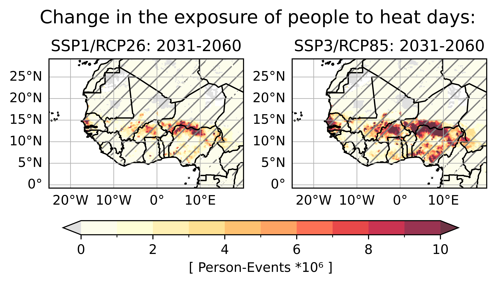

# Population Exposure to Extreme Heat Days in Africa

This repository documents the procedure used to develop maps of climate heat indicators for Africa based on [CORDEX-CORE AFR-22](https://cordex.org/experiment-guidelines/cordex-cmip5/cordex-core/cordex-core-simulations/) data (1,2,3).

We follow the workflow described in the paper:

*Weber, T., Bowyer, P., Rechid, D., Pfeifer, S., Raffaele, F., Remedio, A. R., et al. (2020). Analysis of compound climate extremes and exposed population in Africa under two different emission scenarios. Earth's Future, 8, e2019EF001473. https://doi.org/10.1029/2019EF001473*

## Ingredients:

### Climate Index

For the calculation of the number of extrem heat days (maximum temperature > 40°C) we use the [index_calculator](https://github.com/climate-service-center/index_calculator). This is using [xclim](https://github.com/Ouranosinc/xclim). In addition to the climate change signal, the [robustness](significance.md) is also indicated.

### Environment

    conda env create -f afrheat.yml

    conda activate afrheat

### Future Population

The information about the [population](population.md) data source. 

With the following Notebook you can remap the population files and calculate the country sum .

    Notebooks/remap_population_to_afr22.ipynb
    Notebooks/country_sum_population_to_afr22.ipynb

### Exposure

The change of population and the climate change signal for specific indicators are combined. [Literature](exposure.md)

The exposure of the population to extreme heat days is calculated in the next Notebook.

$\Delta E = P_r \times \Delta C + C_r \times \Delta P + \Delta C \times \Delta P$

### Exposure calculation and plotting

The following Notebook produces the horizontal exposure maps for ssp1/rcp2 and ssp3/rcp85 of population to extrem heat days. The plots show the timeslice  1991-2024 and 2031-2060 as well as its future changes. 

    Notebooks/horiplot-exposure-diff-robust-bulletin.ipynb
    Notebooks/plotting_tools_exposure.py

### References

[1] *Giorgi, F., and Coauthors, 2022: The CORDEX-CORE EXP-I Initiative: Description and Highlight Results from the Initial Analysis. Bull. Amer. Meteor. Soc., 103, E293–E310, https://doi.org/10.1175/BAMS-D-21-0119.1.*

[2] *Remedio, A.R.; Teichmann, C.; Buntemeyer, L.; Sieck, K.; Weber, T.; Rechid, D.; Hoffmann, P.; Nam, C.; Kotova, L.; Jacob, D. Evaluation of New CORDEX Simulations Using an Updated Köppen–Trewartha Climate Classification. Atmosphere 2019, 10, 726. https://doi.org/10.3390/atmos10110726*

[3] *Teichmann, C., Jacob, D., Remedio, A.R. et al. Assessing mean climate change signals in the global CORDEX-CORE ensemble. Clim Dyn 57, 1269–1292 (2021). https://doi.org/10.1007/s00382-020-05494-x*

## Contact

katharina.buelow@hereon.de and torsten.weber@hereon.de

